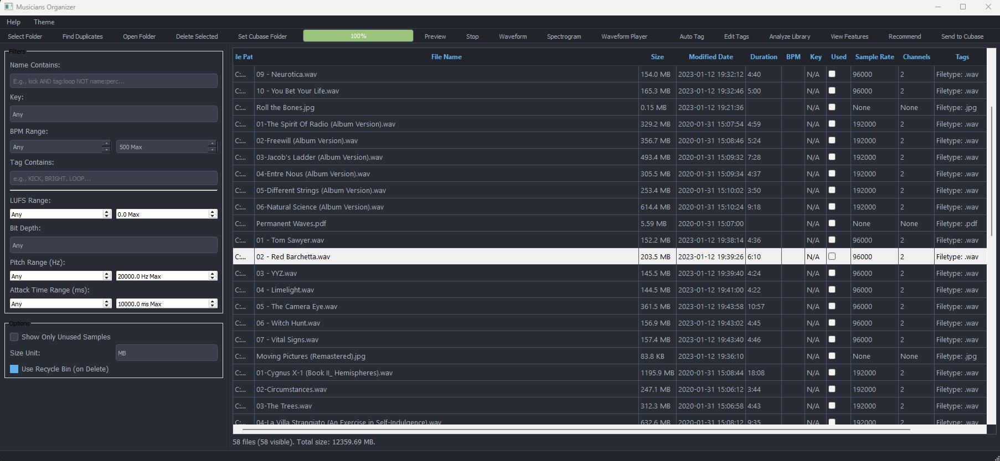
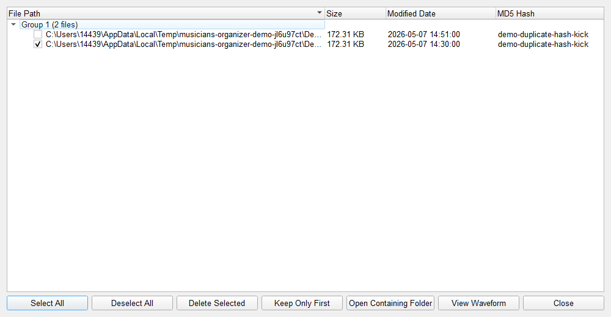
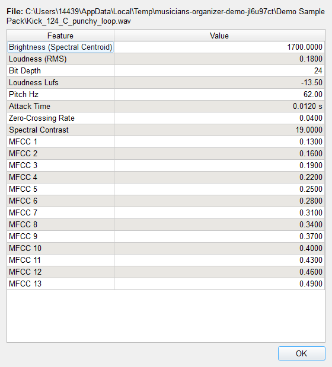
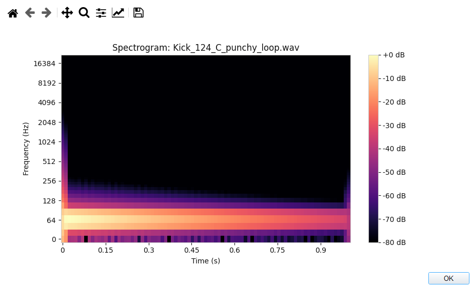
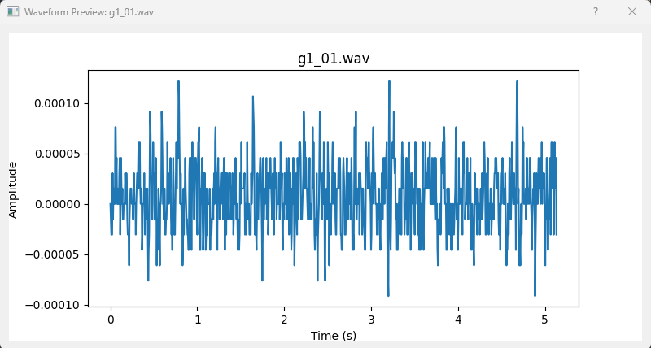

# Musicians Organizer

Musicians Organizer is a desktop tool for working with large local audio libraries.
It focuses on practical file-library operations: scan folders, persist metadata,
run analysis, filter/tag results, and handle duplicates without leaving the app.

This project exists because once a sample library grows, folder names alone stop
being enough. You need a repeatable workflow for finding files, tracking metadata,
and cleaning the library over time.

## Start here

- Start with the [Visual Walkthrough](#visual-walkthrough) for the current UI.
- Run the app with the [Quick Start](#quick-start-deterministic-path) if you have Python 3.11 available.
- Read the [workflow walkthrough](docs/workflow-walkthrough.md) for the scan -> dedupe -> analyze -> filter/tag -> similar-search loop.
- Check [Tradeoffs and Limitations](#tradeoffs-and-limitations) before relying on auto-tagging or similarity results.

## What It Is

- Local-first desktop app for music producers and sound designers with large sample libraries.
- SQLite-backed file library with scanning, filtering, tagging, duplicate review, and feature inspection.
- Practical alternative to cloud cataloging when the media files should stay on your machine.

## Status Snapshot

- Working now: recursive scanning, SQLite persistence, filtering, duplicate detection, background analysis, waveform/spectrogram previews, similarity recommendations, and multi-dimensional tags such as `instrument:KICK`.
- Target runtime is Python 3.11; CI currently exercises Python 3.10 and 3.11.
- Setup can be sensitive to PyQt5, audio, plotting, and scientific-package differences across systems.
- Auto-tagging is heuristic. Similarity quality depends on feature coverage and distribution in the user's own library.
- "Send to Cubase" is intentionally narrow and should not be read as a general DAW bridge.

For planned cleanup and packaging work, see [ROADMAP.md](ROADMAP.md).

## Visual Walkthrough

These dark-mode screenshots show the main workflows: library filtering,
duplicate review, feature inspection, spectrogram preview, and waveform preview.
Media files stay local; the repository includes only screenshots and workflow
documentation.



| Duplicate review | Feature inspection |
| --- | --- |
|  |  |

| Spectrogram preview | Waveform preview |
| --- | --- |
|  |  |

## Quick Start (Deterministic Path)

Target runtime is Python 3.11. CI currently exercises Python 3.10 and 3.11.

1) Clone and enter the repository:

```bash
git clone https://github.com/mmaitland300/musicians-organizer.git
cd musicians-organizer
```

2) Create and activate a virtual environment:

Windows (PowerShell):

```bash
py -3.11 -m venv .venv
.\.venv\Scripts\Activate.ps1
```

If `py` is unavailable, use an explicit Python 3.11 executable path.

macOS / Linux:

```bash
python3.11 -m venv .venv
source .venv/bin/activate
```

3) Install dependencies:

```bash
python -m pip install --upgrade pip
python -m pip install -r requirements.txt
python -m pip install -r requirements-dev.txt
```

Installs use **pip and the requirement files only** (same as CI). `pyproject.toml`
holds Black and isort settings; it is not a second install manifest or lockfile.
`requirements.txt` is the runtime app set. `requirements-dev.txt` is limited to
formatting, linting, type-checking, and test tools. `constraints.txt` preserves
known-good transitive pins without mixing them into the direct dependency lists.

4) Run the app:

```bash
python main.py
```

## Database and Environment Notes

- Default DB path: `~/.musicians_organizer.db`
- Override DB path with: `MUSICORG_DB_PATH`
- Alembic migration scripts live in `migrations/`

If you need to run migrations manually:

```bash
alembic upgrade head
```

## Reproducible Verification Steps

Run from the repository root with your virtual environment active.
The commands below mirror current CI behavior:
For a fresh local verification baseline, recreate `.venv` before running checks.

```bash
python -m black --check .
python -m isort --check-only .
python -m flake8 config services models utils main.py
python -m mypy .
python -m pytest -q --maxfail=1 --disable-warnings
```

Flake8 is intentionally scoped to maintained core modules for now. That scoped
check is blocking in CI.

## Architecture and Runtime Workflow

Core flow is:

1. Scan files from selected root folder
2. Persist/update records in SQLite
3. Run analysis workers for feature extraction
4. Filter/search/tag records in the UI
5. Inspect/manage duplicates and related files

Main runtime path:

- `main.py` initializes Qt app and database manager
- `ui/main_window.py` owns UI state, model, and action wiring
- `ui/controllers.py` coordinates background workers and state transitions
- `services/file_scanner.py` handles scan + incremental sync behavior
- `services/database_manager.py` manages upsert/query/statistics/similarity logic
- `services/schema.py` + `migrations/` define schema and migrations

## Supporting Workflow Docs

- Visual README assets: [`docs/readme/`](docs/readme/)
- Concrete walkthrough artifact: [`docs/workflow-walkthrough.md`](docs/workflow-walkthrough.md)
- The walkthrough captures a full desktop workflow (scan -> dedupe -> analyze ->
  filter/tag -> similar search) with expected outcomes and optional DB checks.

## Tradeoffs and Limitations

- **Packaging:** This is a Python/PyQt desktop project, not a packaged consumer release yet.
- **Operational cost:** Advanced analysis is CPU-heavy on large libraries.
- **Dependency constraints:** Audio + plotting stacks can be sensitive to OS
  and local media backend differences.
- **Heuristic metadata:** Key/BPM/tag inference can be wrong; manual review is
  still part of the workflow.
- **Similarity model scope:** Distance calculations are feature-based and tuned
  for practical retrieval, not musicological correctness.
- **Desktop scope:** This is a local desktop workflow tool, not a collaborative
  service or cloud pipeline.

## Failure Modes to Expect

- Missing optional system media libraries can reduce playback/analysis features.
- Corrupted/unreadable files may be skipped with warnings during scan.
- Large scans can take time; cancellation and progress handling are implemented
  but long-running operations still need user patience.
- Inconsistent feature coverage across files can reduce similarity quality.

## Unfinished Scope

- Better packaging/distribution workflow for non-dev users
- More robust progress/error visibility for long analysis jobs
- Additional workflow-oriented tagging improvements
- Better cross-DAW export/integration primitives (currently Cubase-specific path)

## Community and Project Notes

- License: [MIT](LICENSE)
- Contributions: [CONTRIBUTING.md](CONTRIBUTING.md)
- Security reporting: [SECURITY.md](SECURITY.md)
- Roadmap: [ROADMAP.md](ROADMAP.md)

## Project Structure

```text
musicians-organizer/
|-- main.py
|-- config/
|-- models/
|-- services/
|-- ui/
|-- docs/
|-- migrations/
|-- tests/
|-- requirements.txt
|-- requirements-dev.txt
|-- constraints.txt
`-- .github/workflows/ci.yml
```
